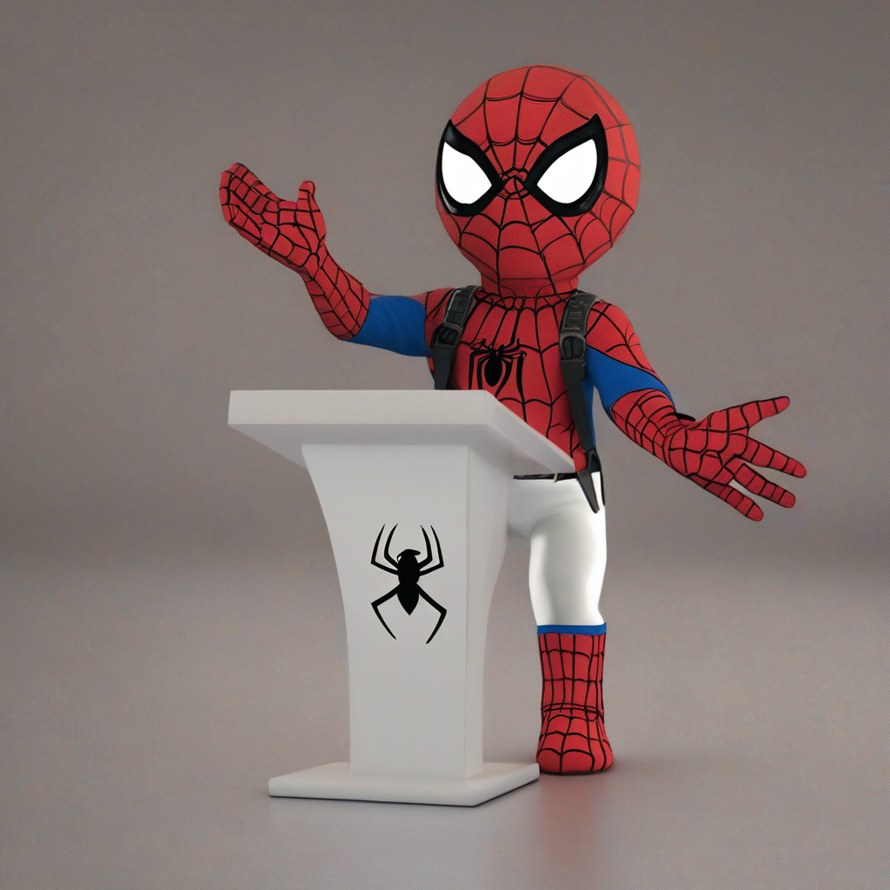

# diffusers/controlnet-depth-sdxl-1.0 Cog model

This is an implementation of the [diffusers/controlnet-depth-sdxl-1.0](https://huggingface.co/diffusers/controlnet-depth-sdxl-1.0) as a Cog model. [Cog packages machine learning models as standard containers.](https://github.com/replicate/cog)

First, download the pre-trained weights:

    cog run script/download-weights

Then, you can run predictions:

    cog predict -i image=@demo.png -i prompt="spiderman lecture, photorealistic"

## Example:

Input:

"spiderman lecture, photorealistic"

Output:

